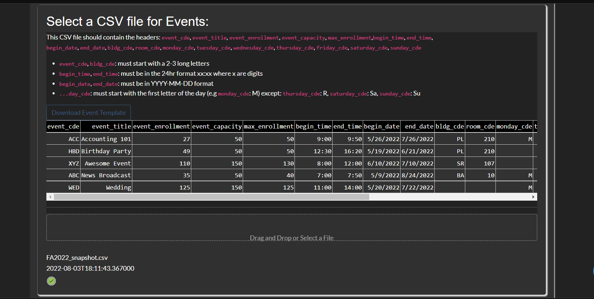
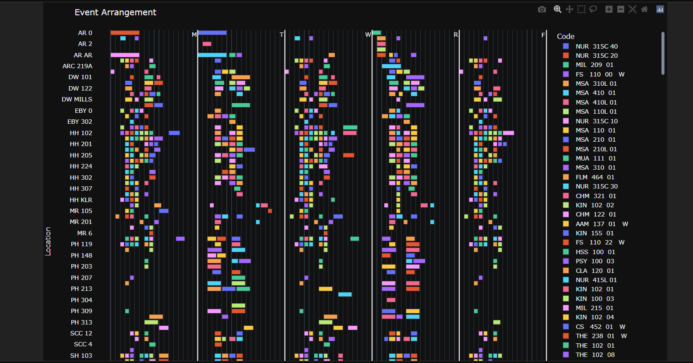

# Event Arrangement

This is a web application that allows users to:
- input events, locations and location preferences (optional)
- generate a schedule
- visualize and download a figure with the placed events
- download a csv with the placed events

### Snapshots:
- 
- 
